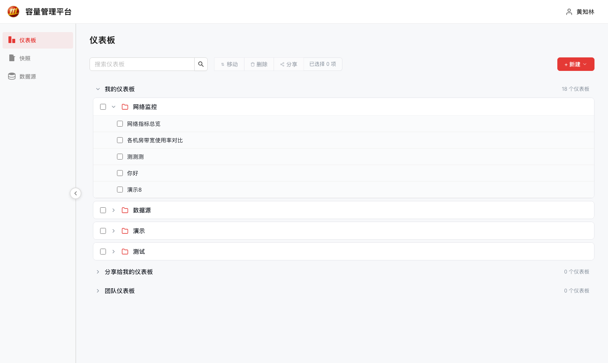
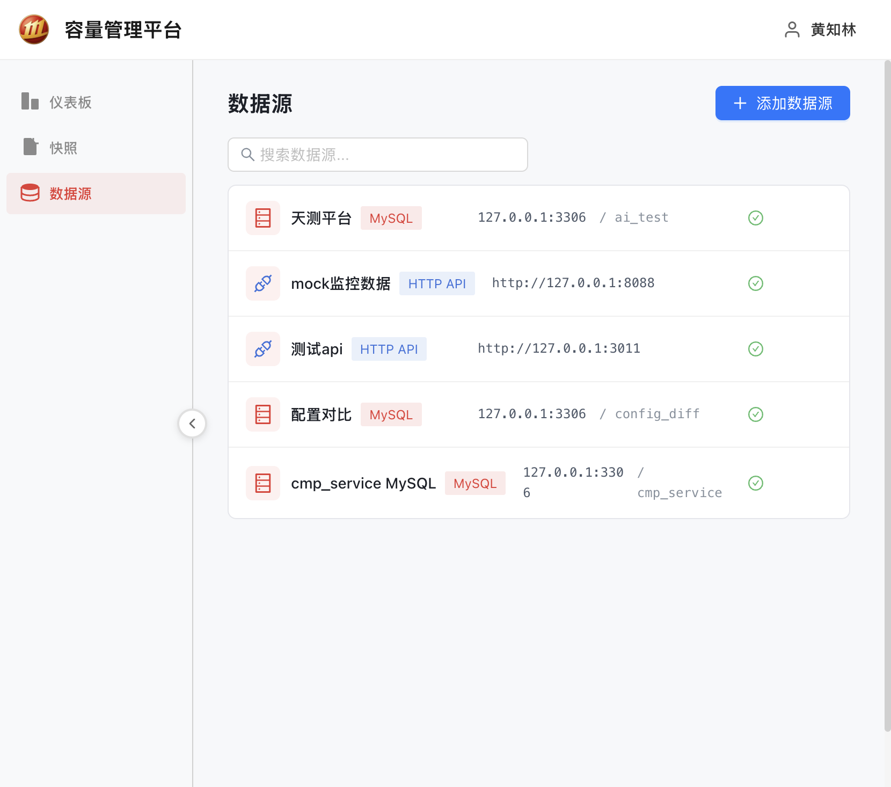
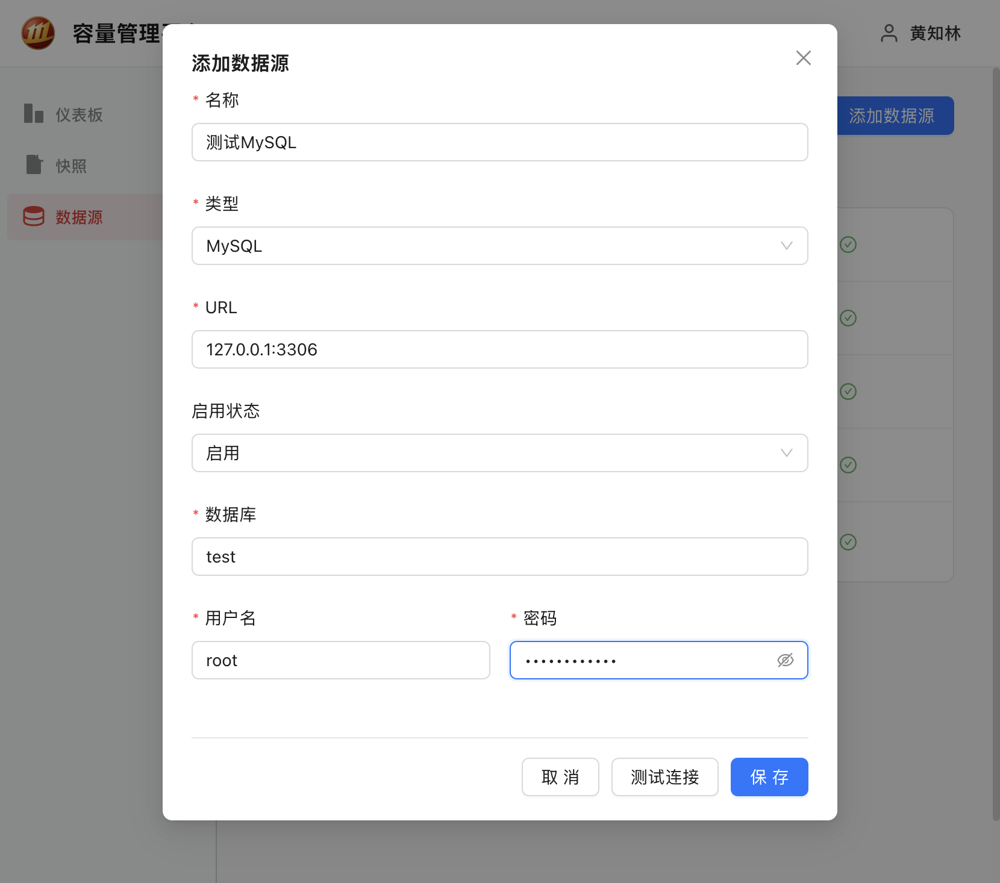
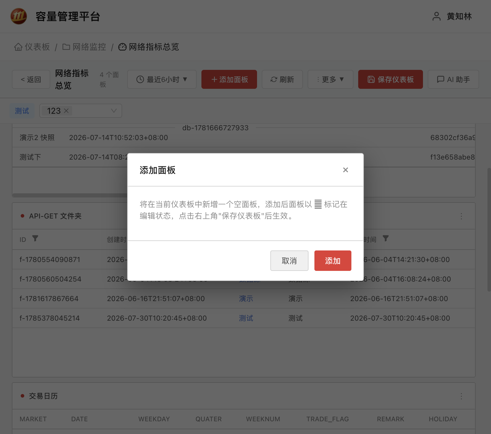
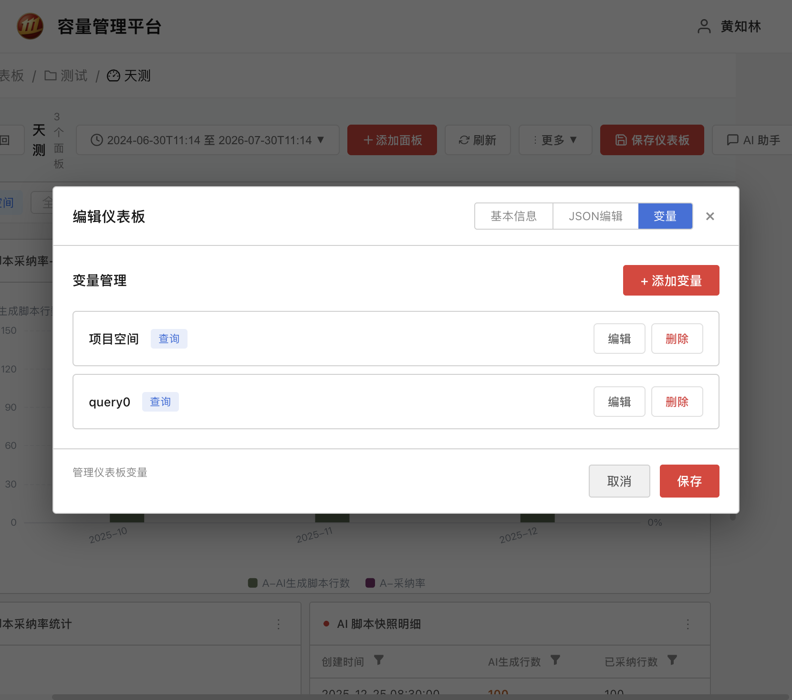
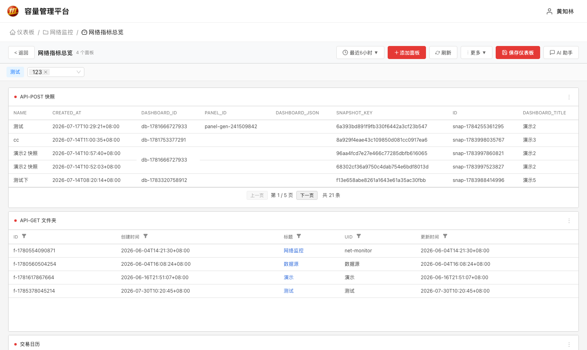
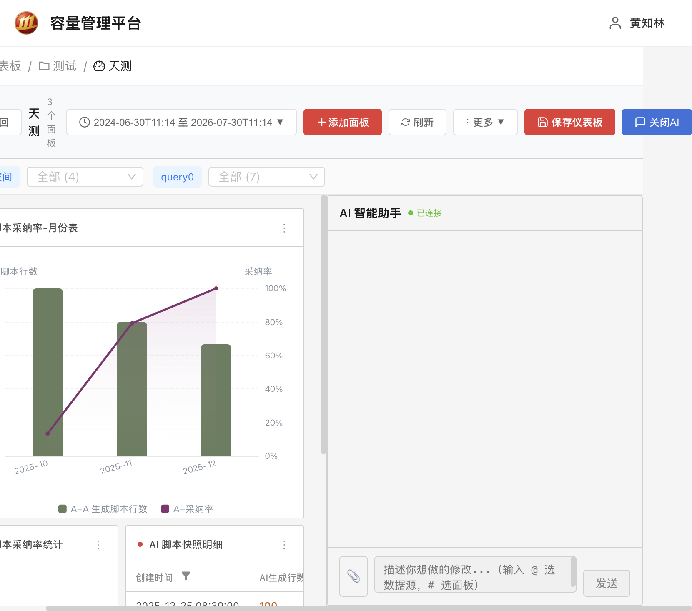
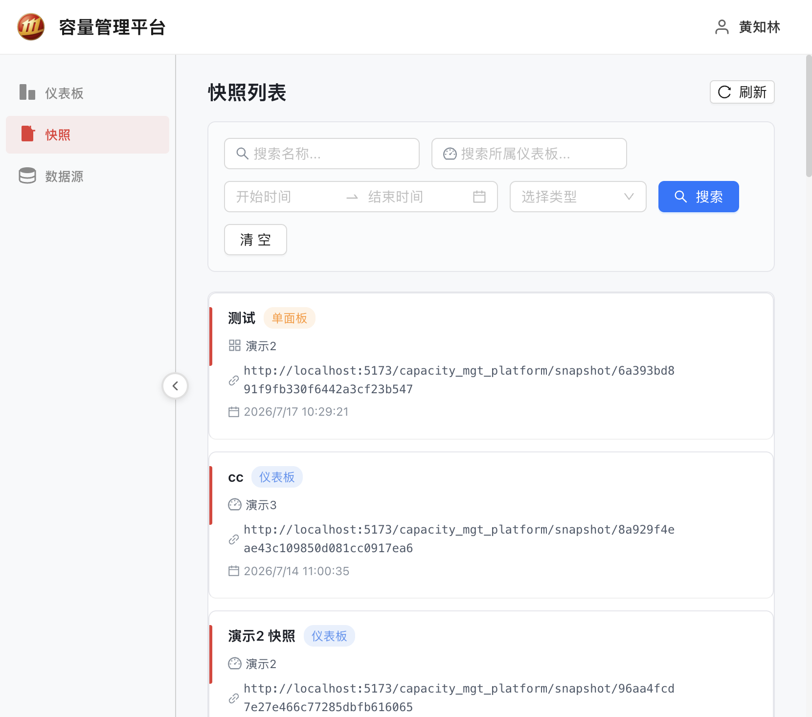
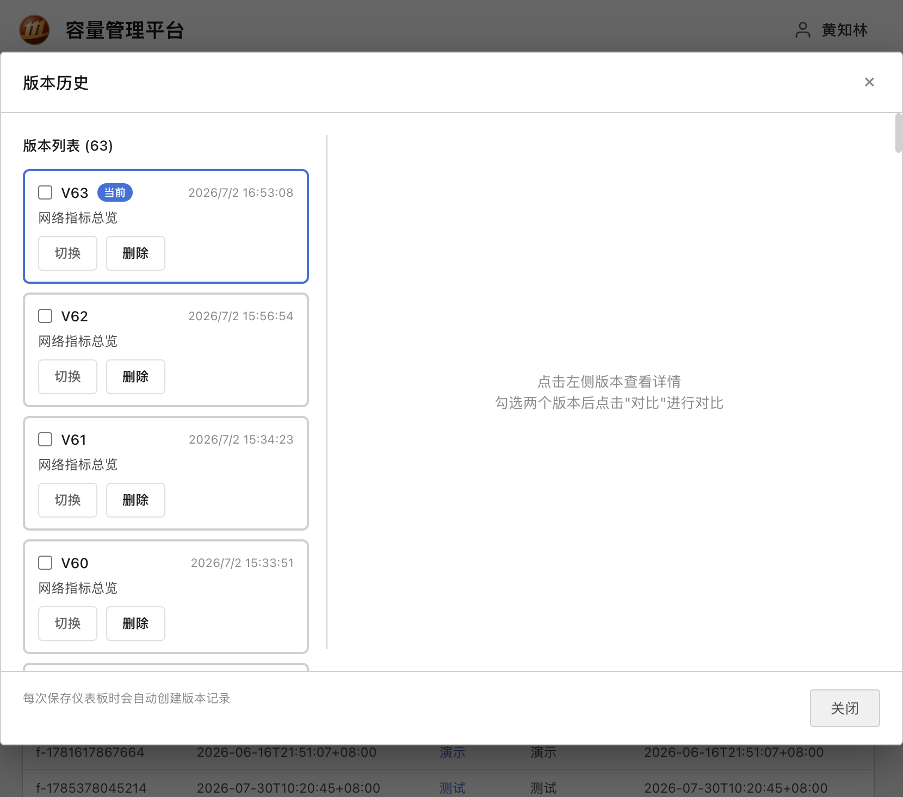
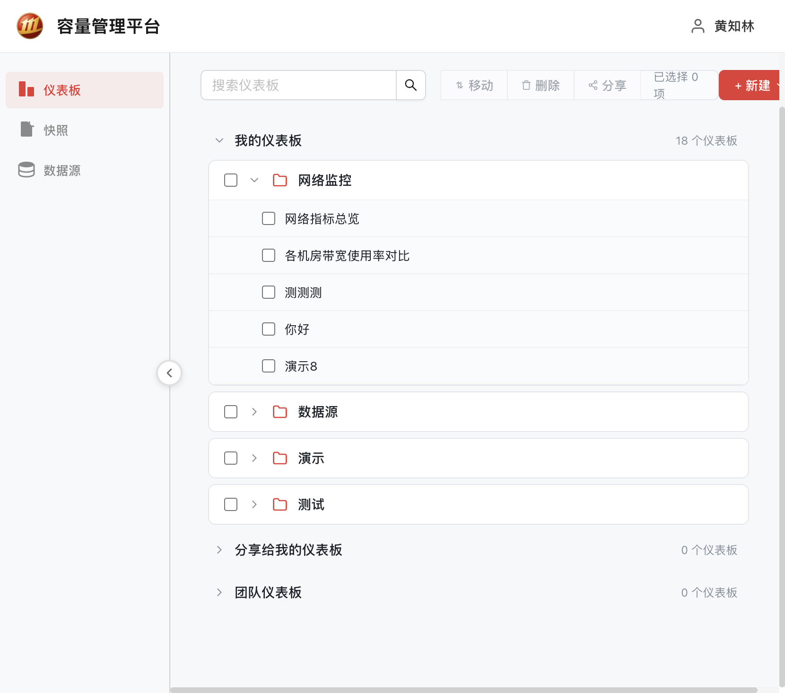

# 容量管理平台 用户操作手册

> 面向新用户的操作指南。本平台用于集中管理数据源、创建可视化仪表板、配置动态变量，并借助 AI 助手快速完成数据分析与面板配置。

---

## 目录

1. [平台简介](#1-平台简介)
2. [快速上手：创建你的第一个仪表板](#2-快速上手创建你的第一个仪表板)
3. [数据源管理](#3-数据源管理)
4. [仪表板管理](#4-仪表板管理)
5. [面板配置](#5-面板配置)
6. [变量配置](#6-变量配置)
7. [时间范围选择](#7-时间范围选择)
8. [AI 智能助手](#8-ai-智能助手)
9. [生成分析报告](#9-生成分析报告)
10. [快照与分享](#10-快照与分享)
11. [版本历史](#11-版本历史)
12. [查询检查器（调试 SQL）](#12-查询检查器调试-sql)
13. [常见问题](#13-常见问题)

---

## 1. 平台简介

容量管理平台帮助你：

- **统一管理数据源**：支持 MySQL 数据库和 HTTP API 两种数据源；
- **可视化搭建仪表板**：表格、柱状图、时间序列、饼图、仪表盘等多种图表类型；
- **动态过滤数据**：通过变量（如按服务器、按环境筛选）让同一张仪表板适用不同场景；
- **AI 辅助分析**：内置 AI 助手，对话式修改面板配置、生成分析报告；
- **分享与沉淀**：一键创建快照分享链接、定时快照、版本历史回滚。

---

## 2. 快速上手：创建你的第一个仪表板

### 步骤一：进入仪表板列表

打开平台首页（默认地址 `http://localhost:5173/capacity_mgt_platform/`），左侧导航栏点击 **仪表板**。



### 步骤二：创建仪表板

1. 点击右上角 **+ 新建** 按钮，选择 **新建仪表板**；
2. 在弹出的窗口中填写：
   - **仪表板名称**（必填）：例如"线上服务监控"；
   - **所属文件夹**（必选）：选择存放位置，如"我的仪表板"；
   - **图表模板**：选择内置示例模板（如柱状图），也可以选择空模板。
3. 点击 **创建**，系统自动进入仪表板详情页。

### 步骤三：添加面板

1. 在仪表板详情页右上角点击 **+ 添加面板**，新增一个空表格面板；
2. 鼠标悬停面板，点击面板右上角菜单 → **编辑**，进入全屏面板编辑器；
3. 在编辑器中完成数据源、查询语句和图表样式的配置（详见 [第 5 节](#5-面板配置)）；
4. 点击 **保存** 返回仪表板，再点击顶部 **保存仪表板** 按钮将变更持久化。

> 💡 **提示**：面板的增删改都需要点击 **保存仪表板** 才会真正生效。有未保存变更时，工具栏会显示黄色"未保存"标记。

---

## 3. 数据源管理

### 3.1 数据源类型

| 类型 | 适用场景 | 连接信息 |
| ---- | ---- | ---- |
| **MySQL** | 直接查询数据库 | 地址 `host:port`、数据库名、用户名、密码 |
| **HTTP API** | 调用外部接口 | URL、认证方式、自定义 Header |



### 3.2 添加数据源

1. 左侧导航栏点击 **数据源**；
2. 点击右上角 **添加数据源**；
3. 填写配置：
   - **通用**：名称（必填）、类型（必填）、URL（必填）、是否启用；
   - **MySQL 额外**：数据库名、用户名、密码（均必填）；
   - **HTTP 额外**：认证方式（无认证 / Bearer Token / API Key / Basic Auth）、超时时间（1–60 秒）、自定义 Headers。
4. 点击 **测试连接** 验证配置是否正确；
5. 测试通过后点击 **保存**。



### 3.3 编辑 / 删除 / 启用禁用

- 悬停数据源行，显示 **编辑** 和 **删除** 按钮；
- 编辑弹窗内可修改任意配置并重新测试；
- 删除前会弹出确认框（不可撤销）；
- 列表中的启用/禁用图标可随时开关数据源。

---

## 4. 仪表板管理

### 4.1 文件夹与仪表板

- 点击 **+ 新建 → 新建文件夹**，输入名称即可创建文件夹；
- 文件夹可展开/折叠，显示其中的仪表板；
- 勾选仪表板后可使用工具栏的 **移动** 按钮批量调整所在文件夹。

### 4.2 搜索

- 顶部搜索框按名称过滤文件夹和仪表板；
- 点击搜索结果中的仪表板直接进入详情页。

### 4.3 重命名

- 在仪表板详情页点击 **更多（⋮）→ 编辑仪表板 → 基本信息**，修改标题后保存。

### 4.4 删除

- 单删：仪表板行右侧 **删除** 按钮，弹窗确认；
- 批量删：勾选后点工具栏 **删除**（删除文件夹会连带删除内部仪表板，请谨慎操作）。

---

## 5. 面板配置

### 5.1 支持的图表类型

| 类型 | 说明 |
| ---- | ---- |
| **表格 table** | 以表格展示原始数据，支持列筛选、合并单元格、字段显示顺序 |
| **柱状图 bar** | 支持纵向/横向切换 |
| **时间序列 timeseries** | 折线/柱状/散点混合，每个字段可独立设置样式（Graph styles），多数值列自动启用双 Y 轴（左轴为第一列、右轴为第二列） |
| **饼图 pie** | 占比展示 |
| **仪表盘 gauge** | 支持最小值/最大值、单位（%、ms、bytes）、阈值分色 |



> 📐 **数据格式约定**：查询结果中**第一列作为 X 轴/分类**，后续数值列作为 Y 轴数据。

### 5.2 配置 MySQL 查询

1. 顶部选择数据源（MySQL 类型）；
2. 在 SQL 编辑器中编写查询，例如：

```sql
SELECT server_name, cpu_usage, memory_usage
FROM server_metrics
WHERE server_name IN ($server)
  AND create_time >= $__fromUnix AND create_time <= $__toUnix
```

3. 可用变量提示（编辑器内点击变量名即可插入）：
   - 系统时间变量：`$__from`、`$__to`（ISO 格式，自动加引号）、`$__fromUnix`、`$__toUnix`、`$__fromMs`、`$__toMs`（数字）；
   - 自定义变量：`$变量名`（详见 [第 6 节](#6-变量配置)）。
4. 使用 **查询检查器** 可立即查看变量替换后的最终 SQL 和查询结果（见 [第 12 节](#12-查询检查器调试-sql)）。

### 5.3 配置 HTTP 请求

1. 顶部选择数据源（HTTP 类型）；
2. 填写 **API 路径**（页面自动拼接完整 URL）、选择请求方法 **GET / POST**；
3. POST 时选择请求体类型：Raw JSON / Form Data / x-www-form-urlencoded / GraphQL；
4. 配置 **数据解析**：数据格式（JSON / XML / CSV）+ 数据路径（JSONPath，如 `data.results`）；
5. 可添加自定义 Headers（优先级：认证 Headers > 查询 Headers > 数据源 Headers）。

### 5.4 多查询与表达式

- 点击 **+ 添加查询**：多条查询各作为一个数据系列，需设置图例名称（如 A、B、C）；
- 点击 **+ 添加表达式**：使用 Math 表达式组合已有查询（如 `$A + $B`）。

### 5.5 选项配置（右侧"选项"面板）

- **图表类型**：切换可视化类型卡片；
- **柱状图方向**：纵向 / 横向；
- **时间序列字段样式**：为每个数值字段分别设置 Lines / Bars / Points 及颜色；
- **仪表盘**：最小值 / 最大值 / 单位 / 数值模式 / 阈值分色；
- **布局**：X / Y / 宽 / 高（24 列栅格，也可在仪表板页面直接拖拽调整）；
- **表格选项**：启用列筛选、每页显示条数（默认 5）、合并单元格、字段显示顺序；
- **条件告警（预警）**：启用后添加规则（选择列 + 运算符 + 阈值 + 高亮颜色），满足条件的单元格/数据点自动高亮；
- **Data Links**：为字段配置超链接，支持变量 `${__value}`（当前值）、`${__field.name}`（字段名）、`${__row.field}`（行内其他字段值）。

### 5.6 预览与保存

- 编辑器左上方有 **刷新预览** 按钮，实时查看图表效果；
- 点击 **保存** 返回仪表板；**丢弃** 放弃本次修改。

---

## 6. 变量配置

变量让仪表板具备动态筛选能力。例如：变量 `server` 列出所有服务器，用户选择后所有面板只展示该服务器的数据。

### 6.1 入口

仪表板详情页点击 **更多（⋮）→ 编辑仪表板 → 变量** Tab。



### 6.2 变量类型

| 类型 | 说明 |
| ---- | ---- |
| **自定义 custom** | 手动填写选项列表（逗号分隔） |
| **查询 query** | 从数据源查询获取选项（如 `SELECT DISTINCT server_name FROM servers`），编辑时可预览查询结果 |
| **文本框 textbox** | 用户自由输入文本（可配置默认值） |
| **常量 constant** | 隐藏的固定值 |
| **数据源 datasource** | 在多个数据源之间切换 |
| **时间间隔 interval** | 时间间隔选择器 |

### 6.3 常用配置项

- **名称**（必填）：SQL 中引用时使用，如 `$server`；
- **标签**：在变量选择条上的显示名称；
- **多选**：允许多选（默认自动全选）；
- **包含"全部"选项**：开启后选择器顶部出现"全部"按钮，选择"全部"时使用**查询到的所有值**参与筛选（而不是通配符）；
- **隐藏**：勾选后变量选择条不显示，但变量值仍然生效；
- **依赖变量**（查询类型）：勾选上游变量后，上游变化时自动刷新并全选；
- **默认值**：页面加载时变量采用的初始值。

### 6.4 在 SQL / HTTP 中引用

- 直接使用 `$变量名`，多选/全部时自动展开为 `'值1','值2'` 格式；
- 示例：变量 `server` 的值为 `web-01`，则 `WHERE server_name IN ($server)` 实际执行为 `WHERE server_name IN ('web-01')`；
- 变量当前值会同步到 URL 参数（`var-变量名`），分享链接时对方打开即可看到相同筛选状态。

### 6.5 变量依赖示例

配置两个变量实现级联筛选：

- `query0`：`SELECT name FROM datasources` —— 列出所有数据源名称；
- `query1`：`SELECT id FROM datasources WHERE name IN ($query0)` —— 根据 query0 的选择结果筛选 ID。

用户选择 query0 的值后，query1 会自动刷新；选择"全部"时，query1 会基于 query0 的全部值进行查询。

---

## 7. 时间范围选择

仪表板右上角的时间按钮提供 Grafana 风格的时间筛选：

- **相对时间**：5 分钟 / 30 分钟 / 1 小时 / 6 小时 / 12 小时 / 24 小时 / 2 天 / 7 天 / 30 天；
- **绝对时间**：今天 / 昨天 / 前天 / 上周今天；
- **自定义范围**：输入"从/至"后点击 **应用时间范围**。

选择后立即刷新数据；时间范围会同步到 URL 参数（`from` / `to`），可直接复制链接分享当前时间视图。



---

## 8. AI 智能助手

### 8.1 开启对话

1. 进入仪表板详情页；
2. 点击右上角 **AI 助手**，右侧滑出聊天侧边栏；
3. 顶部显示连接状态（绿色"已连接" / 黄色"重连中"），断线自动重连。



### 8.2 基本用法

- 输入问题按 **Enter** 发送，**Shift+Enter** 换行；AI 流式输出，Markdown 渲染；
- 生成过程中可点击 **停止** 终止；
- 消息分为"模型输出 / 思考过程 / 工具调用"三类，思考过程和工具调用默认折叠，可点击展开查看。

### 8.3 快捷指令

- **`@数据源名`**：输入 `@` 弹出数据源列表，选择后自动把该数据源信息注入 AI 上下文；
- **`#面板名`**：输入 `#` 弹出面板列表，选择后 AI 自动获得该面板的完整配置；
- **📎 上传附件**：支持 `.txt / .md / .pdf / .docx / .xlsx / .jpg / .jpeg / .png`，可多选。

### 8.4 AI 修改面板配置

用自然语言让 AI 修改面板，例如：

> "把面板 A 的图表类型改为柱状图，查询条件增加 server='web-01'"

AI 返回 `update_draft` 指令后，系统自动把变更合并到仪表板并立即刷新预览，AI 消息下方出现绿色 **"面板配置已更新"** 标记。确认无误后记得点击 **保存仪表板** 持久化。

---

## 9. 生成分析报告

1. 进入仪表板详情页；
2. 点击 **更多（⋮）→ 生成报告**；
3. 系统自动基于当前仪表板所有面板的数据生成 Markdown 中文分析报告，内容包含：
   - 数据概览和关键发现；
   - 趋势分析；
   - 异常点和重要变化；
   - 建议和结论。
4. 报告生成后可：
   - **下载报告**（.md 文件）；
   - **复制内容**；
   - **重新生成**。

> 💡 同一仪表板的报告结果会被缓存，重复打开直接显示上次结果。

---

## 10. 快照与分享

### 10.1 创建快照

- 仪表板级：详情页 **更多（⋮）→ 创建快照**，输入名称（可选）后创建；
- 面板级：面板编辑器 → **共享** Tab → 创建快照（需先点击"刷新"获得预览数据）。

### 10.2 分享链接

创建成功后生成分享链接：

```
/capacity_mgt_platform/snapshot/{snapshot_key}
```

新窗口打开即可查看，支持 **复制链接** 和 **删除**。

### 10.3 定时快照

1. 详情页 **更多（⋮）→ 定时快照**；
2. 点击 **添加定时任务**；
3. 选择执行时间：预设（每天 08:00 / 12:00 / 18:00 / 22:00、工作日 08:00 / 18:00）或 **自定义 cron 表达式**；
4. 任务列表支持启用/禁用开关、编辑、删除，并显示上次/下次执行时间。

### 10.4 快照列表页

左侧导航 **快照** 进入，支持按名称、所属仪表板、创建时间范围、类型筛选；每行可查看、复制链接、删除。



---

## 11. 版本历史

> 每次点击 **保存仪表板** 都会自动创建一个版本记录（V1、V2…）。

1. 详情页 **更多（⋮）→ 版本历史**；
2. **查看**：单击版本查看标题、创建时间、说明、完整 JSON 定义；
3. **回滚**：点击版本右侧 **切换** 按钮，确认后恢复到该版本；
4. **对比**：勾选两个版本后点击 **对比**，可查看报表变更统计（新增/删除/修改的面板）和 JSON 差异（红绿高亮）；
5. **删除**：删除不再需要的版本记录。



---

## 12. 查询检查器（调试 SQL）

面板编辑器中每条查询下方都内置了 **查询检查器**：

- 点击 **刷新** 立即执行当前查询并展示结果，无需离开编辑器；
- **MySQL**：显示变量替换后的**最终 SQL**，排查变量引用问题非常方便；
- **HTTP**：显示 cURL 命令、请求方法/URL、Headers、请求体、Form Data、实际请求 URL；
- 查询错误以红色区块显示；结果以表格展示列名、行数。



---

## 13. 常见问题

**Q1：面板修改后没有生效？**
A：面板的增删改都只修改了草稿，必须点击工具栏 **保存仪表板** 才会持久化。

**Q2：查询结果为空？**
A：使用**查询检查器**查看变量替换后的最终 SQL，在数据库中手动执行验证；重点检查：
- 变量名是否写对（`$变量名`）；
- 时间变量 `$__fromUnix`/`$__toUnix` 是否与时间范围匹配；
- 变量为"全部"时应展开为具体值列表而非 `*`。

**Q3：下拉框没有选项？**
A：确认查询类型的变量已配置**数据源**和 **SQL**；在变量编辑器中点击"刷新"预览可选值。

**Q4：保存仪表板后图表顺序变了？**
A：图表会统一按 X 轴时间正序排列，这是预期行为。

**Q5：AI 助手连不上？**
A：确认 AI Agent 服务已启动（默认 WebSocket 地址 `ws://127.0.0.1:8764`），页面会自动重连。

**Q6：如何让同事看到我配置的仪表板？**
A：使用 **创建快照** 生成分享链接发送给对方；对方打开链接即可查看快照内容。

**Q7：误操作想恢复怎么办？**
A：使用 **版本历史** 一键回滚到任意历史版本。

---

*文档版本：v1.0 · 适用于容量管理平台*
